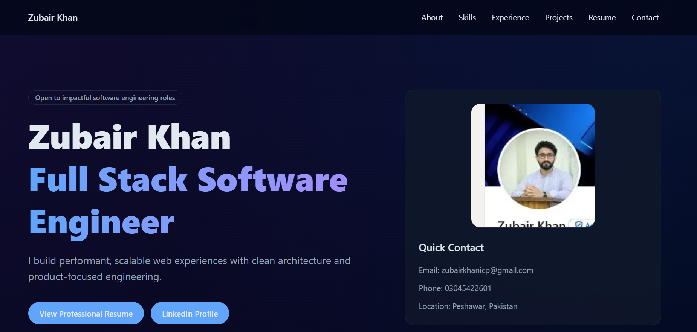

# Zubair Khan — Portfolio

🔗 **Live:** https://portfolio-website-nu-gilt.vercel.app

Premium personal portfolio built with **Next.js App Router**, **React**, **TypeScript**, and **Tailwind CSS**.



## Sections

| Section | Description |
|---|---|
| About | Bio and intro |
| Skills | Tech stack and tools |
| Experience | Work history |
| Projects | Featured projects with links |
| Resume | Downloadable PDF resume |
| Contact | Email and social links |

## Run locally

```bash
npm install
npm run dev
```

Open http://localhost:3000

## Deploy

[](https://vercel.com/new/clone?repository-url=https://github.com/zubair-khan-Eng/portfolio-website)

1. Click the button above
2. Replace `https://example.com` in `src/app/layout.tsx` and `src/app/sitemap.ts` with your domain
3. Add your resume PDF at `public/resume/zubair-khan-resume.pdf`

## Quick update map

| What | File |
|---|---|
| Personal & resume content | `src/data/portfolio.ts` |
| Home sections layout | `src/components/portfolio/HomeSections.tsx` |
| Resume page | `src/components/portfolio/ResumeLayout.tsx` |
| Navigation | `src/components/portfolio/Navbar.tsx` |
| Global styles | `src/app/globals.css` |

## License

MIT © Zubair Khan
